# l2s4-projet-2026

## Equipe 5
- Son Tung DO
- Sabine Boukais
- Ines Agueniou
- Yanni Moutchou

---

## Sujet
[Le sujet 2026](lien-vers-sujet)

---

## Livrables

### Livrable 1

#### Atteinte des objectifs

Le projet remplit actuellement les objectifs du premier livrable, à savoir la mise en place d'un système de plateau capable de générer deux types de structures de jeu distinctes. Deux types de plateaux ont été créés : le `FreeBoard`, où les chemins sont des lignes droites allant d'un bord à l'autre, et le `DefinedBoard`, où un chemin est généré de manière aléatoire en utilisant une logique de voisins pour éviter les boucles et faire en sorte que chaque cellule ne soit utilisée qu'une seule fois.

Chaque cellule est représentée par un objet `Cell`, qui contient sa position et indique si elle fait partie du chemin. Le plateau est représenté par une classe abstraite `Board`, qui contient la grille de cellules ainsi que des méthodes communes pour accéder aux cellules, vérifier les limites et manipuler les chemins. Cette abstraction permet de centraliser les fonctionnalités partagées et de faciliter l'extension : de nouveaux types de plateaux peuvent être créés en héritant de `Board` et en implémentant leurs propres règles de génération de chemins.

Pour `FreeBoard`, un algorithme simple parcourt les bords du plateau pour créer des chemins droits, en s'assurant que le départ et l'arrivée sont toujours sur un bord. Les positions déjà utilisées et leurs voisins sont bloqués pour éviter que les chemins se chevauchent.

Pour `DefinedBoard`, un algorithme aléatoire génère un chemin "serpent" : à chaque étape, la cellule suivante est choisie parmi les voisins disponibles, en évitant de revenir en arrière ou de dépasser les bords. Une longueur minimale est imposée pour éviter que le chemin ne se termine trop vite. Cela garantit un chemin unique et continu sur le plateau.

Difficultés rencontrées : il a été compliqué de trouver le code exact pour générer correctement le chemin aléatoire. Au début, des bugs apparaissaient souvent, comme des chemins très courts allant de deux cases seulement (départ et fin), ou des chemins qui se terminaient trop vite. Il a fallu ajuster l'algorithme et ajouter des vérifications pour garantir une longueur minimale et un chemin continu sans chevauchement.

#### Commandes

```bash
# Compiler toutes les classes
javac -d classes src/**/*.java

# Exécuter DefinedBoardMain (Livrable1a)
java -cp classes board.Livrable1a 11 5

# Exécuter FreeBoardMain (Livrable1b)
java -cp classes board.Livrable1b 11 5 1

# Compilation des tests
javac -cp junit-console.jar:classes -d classes test/board/*.java

# Exécuter les tests
java -jar junit-console.jar -cp classes --scan-class-path

# Créer le JAR (Livrable1a)
jar cvfe livrable1a.jar board.Livrable1a -C classes .
java -jar livrable1a.jar

# Créer le JAR (Livrable1b)
jar cvfe livrable1b.jar board.Livrable1b -C classes .
java -jar livrable1b.jar
```

#### Difficultés restant à résoudre
Pour le moment, toutes les fonctionnalités du livrable 1 fonctionnent correctement.

---

### Livrable 2

#### Atteinte des objectifs

Le projet remplit actuellement les objectifs du deuxième livrable, à savoir la création des ballons et la gestion de leur progression sur le plateau en fonction du temps.

Les ballons sont représentés par une hiérarchie de classes utilisant l'héritage : une classe mère `Balloon` et deux sous-classes `BalloonPath` (utilisée pour `DefinedBoard`) et `BalloonStraight` (utilisée pour `FreeBoard`), grâce à la méthode `move()`.

**BalloonPath.move() :**
- Récupérer la cellule cible actuelle dans le chemin
- Calculer la distance jusqu'au centre de cette cellule
- Si distance ≤ vitesse : atteindre la cellule et passer à la suivante
- Sinon : avancer de "vitesse" unités vers la cible
- Si fin du chemin : marquer comme inactif

**BalloonStraight.move() :**
- Avancer de "vitesse" unités dans la direction (UP/DOWN/LEFT/RIGHT)
- Vérifier si la position finale est atteinte
- Si oui : marquer comme inactif

**Gestion du temps :** Un compteur `currentTick` s'incrémente à chaque itération. À chaque tic, tous les ballons actifs appellent leur méthode `move()`. Lorsqu'un ballon termine, son temps de sortie est enregistré. La simulation continue tant qu'il reste au moins un ballon actif.

Difficultés rencontrées : La principale difficulté a été de concevoir l'architecture des classes de ballons et de définir comment gérer leur mouvement de manière fluide avec des vitesses différentes.

#### Commandes

```bash
# Compiler
javac -d classes src/board/*.java src/object/balloon/*.java

# Exécuter Livrable2a
java -cp classes board.Livrable2a

# Exécuter Livrable2b
java -cp classes board.Livrable2b

# Tests
javac -cp junit-console.jar:classes -d classes test/board/*.java test/object/balloon/*.java
java -jar junit-console.jar -cp classes --scan-class-path

# JARs
jar cvfe livrable2a.jar board.Livrable2a -C classes .
jar cvfe livrable2b.jar board.Livrable2b -C classes .
```

#### Difficultés restant à résoudre
Pour le moment, toutes les fonctionnalités du livrable 2 fonctionnent correctement.

---

### Livrable 3

#### Atteinte des objectifs

Les tours sont gérées par une hiérarchie de classes s'appuyant sur une classe mère abstraite `Tower`. Cette classe définit le comportement global des défenses grâce aux méthodes suivantes :

**Tower.findTarget() :** Parcourir la liste des ballons présents sur le plateau, vérifier si un ballon est actif et situé dans le rayon de portée, retourner le premier ballon valide comme cible.

**Tower.attack() :** Récupérer une cible via `findTarget()`, déterminer le type d'attaque selon l'effet de la tour (`EffectType`), infliger des dégâts immédiats ou générer un projectile.

**La classe Game** coordonne l'ensemble des entités et assure la progression automatique du jeu via la gestion du temps (`gameTick`) et l'automatisation (`autoPlayA` / `autoPlayB`).

#### Commandes

```bash
make classes     # Compilation
make tests       # Compilation des tests
make runtests    # Lancer les tests
make jar         # Création des Livrables
make clean       # Nettoyage

java -jar livrable3a.jar   # Livrable 3a
java -jar livrable3b.jar   # Livrable 3b
```

#### Difficultés restant à résoudre
Aucune difficulté majeure restante pour ce livrable.

---

### Livrable 4

#### Atteinte des objectifs

Le jeu se déroule en 10 manches successives. Pour les manches 1 à 5, une évolution est appliquée à chaque type de tour si cela est possible. Pour les manches 6 à 10, une évolution est supprimée de chaque type de tour si elles en possèdent.

**run10Manches()** : orchestre les 10 manches, appelle `gererEvolutionAleatoire(true/false)` selon la manche.

**gererEvolutionAleatoire()** : parcourt toutes les tours du plateau en évitant les doublons grâce à un ensemble de symboles déjà traités. Applique ou supprime une évolution aléatoire.

**afficherEvenementsBallons()** : compare l'état des ballons avant et après chaque tick pour détecter et afficher les événements (TOUCHE, DETRUIT, SORTI, RALENTI, ARRETE, REDEMARRE).

Difficultés rencontrées : gestion des évolutions sans doublons (deux tours de chaque type présentes), et sauvegarde de l'état des ballons avant chaque tick pour détecter les changements.

#### Commandes

```bash
make             # Compilation
make tests       # Compilation des tests
make runtests    # Lancer les tests
make jar         # Création des Livrables

java -jar livrable4a.jar   # Livrable 4a
java -jar livrable4b.jar   # Livrable 4b
```

#### Difficultés restant à résoudre
Le code présente encore de la duplication dans la gestion de la boucle principale. Une réorganisation de l'architecture est prévue pour les livrables suivants.

---

### Livrable 5

#### Atteinte des objectifs

Refonte majeure de l'architecture. La classe `Balloon` a été unifiée (suppression de `BalloonPath` et `BalloonStraight`). Introduction des classes `Player`, `Shop`, `Game`, `RoundManager`, `Clock`, `ListChooser` (interface), `HumanListChooser` et `AutoListChooser` pour séparer les responsabilités. Le joueur peut désormais choisir ses actions via un menu (acheter/vendre/évoluer une tour) en mode humain ou automatique.

##### amélioration de livrable

Dans ce livrable, nous avons effectué plusieurs améliorations importantes sur l’architecture du projet.

Tout d’abord, nous avons refactorisé la classe `Game` en la décomposant en plusieurs classes plus spécialisées, notamment `Round`, `RoundManager` ainsi que `Clock`. Cette décomposition permet une meilleure organisation du code et facilite sa maintenance.

La classe `Clock` a été enrichie avec l’intégration d’un thread, permettant de gérer le temps en arrière-plan, en parallèle du programme principal. Cela améliore la gestion du temps sans bloquer l’exécution du jeu.

Nous avons également ajouté un système de gestion des actions via la classe `ListChooser` et ses sous-classes :

- `HumanListChooser` (gestion des actions par un joueur humain)
- `AutoListChooser` (gestion automatique des actions)

Ce système permet de séparer clairement les comportements selon le type de joueur.

Enfin, nous avons poursuivi nos efforts de refactorisation en réduisant les duplications de code et en améliorant la modularité globale du projet.

#### Diagramme UML

```mermaid
classDiagram

%% ─── BOARD ───────────────────────────────────────────────
class Board {
    <<abstract>>
    #int width
    #int height
    #Cell[][] grid
    #Map~Integer,List~Cell~~ allPath
    #List~Tower~ towers
    #List~Balloon~ balloons
    #List~Projectil~ activeProjectiles
    #List~Balloon~ escapedBalloons
    +calculerPath()*
    +getChemins()* List~Cell~
    +init()*
    +getPathPositions()* List~Position~
    +placeTower(Tower, Position)
    +removeTower(Tower)
    +spawnBalloon(Balloon)
    +update() List~Balloon~
    +isCellAvailable(int,int)* boolean
}
class DefinedBoard {
    -List~Cell~ chemins
    -Position cheminAv
    -Position pointDeDepart
    +calculerPath()
    +getPathPositions() List~Position~
    +isCellAvailable(int,int) boolean
}
class FreeBoard {
    -int NBCHEMIN
    -Map~Integer,Position~ numChemins
    -Map~Position,Position~ chemins
    -int nbCheminsVoulus
    +calculerPath()
    +retourneLesChemins(int) Position[]
    +retourneNbrChemins() int
    +getPathPositions() List~Position~
    +isCellAvailable(int,int) boolean
}
class Cell {
    -Position position
    -boolean isPath
    +assignChemin()
    +isPath() boolean
    +estVide() boolean
}
class Position {
    -int row
    -int col
    +getRow() int
    +getCol() int
}
class Direction {
    <<enum>>
    UP
    DOWN
    RIGHT
    LEFT
}
Board <|-- DefinedBoard
Board <|-- FreeBoard
Board "1" *-- "many" Cell
Cell *-- Position

%% ─── BALLOON ─────────────────────────────────────────────
class Balloon {
    #int id
    #double posColonne
    #double posLigne
    #double speed
    #int health
    #BalloonType type
    #boolean active
    #boolean escaped
    #List~Position~ path
    #int pathIndex
    +move() boolean
    +update()
    +hit(int) boolean
    +freeze(int)
    +slow(double, int)
    +hasEscaped() boolean
}
class BalloonType {
    <<enum>>
    BASIC
    MEDIUM
    STRONG
    +int health
    +double speed
    +int reward
}
Balloon --> BalloonType

%% ─── TOWER ───────────────────────────────────────────────
class Tower {
    <<abstract>>
    #Position position
    #int cout
    #int porte
    #int cadence
    #boolean evolution
    #EffectType effectType
    #ProjectilType type
    #Evolution evolutions
    #int degatsSup
    +update(List~Balloon~, List~Projectil~)
    +attack(List~Balloon~)* Projectil
    +appliquerEvolution(TypeEvolution)* int
    +getCoutEvolution(TypeEvolution)* int
    +findTarget(List~Balloon~) Balloon
    +getName()* String
    +getSymbol()* String
    +getCost() int
}
class DartMonkey { +attack() Projectil }
class BombTower  { +attack() Projectil }
class IceTower   { +attack() Projectil }
class SlowTower  { +attack() Projectil }
class TackShooter{ +attack() Projectil }
class EliteSniper{ +attack() Projectil }
class Gorilla    { +attack() Projectil }
class EffectType {
    <<enum>>
    IMMEDIATE
    AREA
    SLOW
    FREEZE
}
Tower <|-- DartMonkey
Tower <|-- BombTower
Tower <|-- IceTower
Tower <|-- SlowTower
Tower <|-- TackShooter
Tower <|-- EliteSniper
Tower <|-- Gorilla
Tower --> EffectType

%% ─── EVOLUTION ───────────────────────────────────────────
class Evolution {
    -List~TypeEvolution~ evolutions
    -Map~TypeEvolution,Integer~ evolutionsPossedees
    +addEvolution(TypeEvolution)
    +deleteEvolutions(TypeEvolution)
    +getEvolutions() List~TypeEvolution~
    +getEvolutionsPossedees() Map
}
class TypeEvolution {
    <<enum>>
    PORTEE
    CANDENCE
    PUISSANCE
    PROJECTILES
}
Tower *-- Evolution
Evolution --> TypeEvolution

%% ─── PROJECTIL ───────────────────────────────────────────
class Projectil {
    <<abstract>>
    #double x
    #double y
    #Balloon target
    #boolean active
    +update()*
    +isActive() boolean
}
class ProjectilSimple { +update() }
class ProjectilBombe  { +update() }
class ProjectilFreeze { +update() }
class ProjectilSlow   { +update() }
class ProjectilType {
    <<enum>>
    FLECHETTE
    BOMBE
    EXTRA_BOMBE
    FLECHETTE_TRES_POINTUE
    GLACON
    RALENTISSEUR
}
class NotMatchException
Projectil <|-- ProjectilSimple
Projectil <|-- ProjectilBombe
Projectil <|-- ProjectilFreeze
Projectil <|-- ProjectilSlow
Projectil --> Balloon
Tower --> ProjectilType

%% ─── GAME ────────────────────────────────────────────────
class Game {
    -Board board
    -Player player
    -RoundManager roundManager
    -Clock clock
    -boolean isRunning
    +runOneRound()
    +onTick(int)
    +hasPlayerLost() boolean
}
class GameContext {
    <<interface>>
    +getPlayer() Player
    +getBoard() Board
}
Game ..|> GameContext
Game ..|> ClockListener
Game --> Board
Game --> Player
Game --> RoundManager
Game --> Clock

%% ─── ROUND ───────────────────────────────────────────────
class Round {
    -int number
    -List~Balloon~ balloons
    +getNumber() int
    +getBalloons() List~Balloon~
}
class RoundManager {
    -List~Round~ rounds
    -Board board
    -int currentIndex
    -boolean playerLost
    +update(int)
    +isCurrentRoundFinished() boolean
    +hasPlayerLost() boolean
}
RoundManager --> Round
RoundManager --> Board
Round *-- Balloon

%% ─── PLAYER / SHOP ───────────────────────────────────────
class Player {
    -int credit
    -List~Tower~ towers
    -ListChooser~Action~ actionChooser
    +buyTower(Tower)
    +sellTower(Tower)
    +chooseAction(List~Action~, GameContext) Action
    +runActionPhase(GameContext, Shop)
    +addCredit(int)
    +removeCredit(int)
}
class Shop {
    -Board board
    +getAvailableTowers() List~Tower~
    +findAvailablePosition() Position
}
Player --> ListChooser
Player --> Tower
Shop --> Board

%% ─── CHOOSER / ACTION ────────────────────────────────────
class ListChooser~T~ {
    <<interface>>
    +choose(String, List~T~) T
}
class HumanListChooser { +choose() Action }
class AutoListChooser  { +choose() Action }
ListChooser <|.. HumanListChooser
ListChooser <|.. AutoListChooser

class Action {
    <<abstract>>
    +execute(GameContext)*
    +getDescription()* String
}
class BuyTowerAction    { +execute(GameContext) }
class SellTowerAction   { +execute(GameContext) }
class UpgradeTowerAction{ +execute(GameContext) }
class SellTowerUpgradeAction{ +execute(GameContext) }
class DoNothingAction   { +execute(GameContext) }
class QuitAction        { +execute(GameContext) }
class RetourAction      { +execute(GameContext) }
class MenuAction {
    -String label
    -List~Action~ sousActions
    +execute(GameContext)
}
class ActionBuilder {
    +buildMenu(Player, Shop)$ List~Action~
}
Action <|-- BuyTowerAction
Action <|-- SellTowerAction
Action <|-- UpgradeTowerAction
Action <|-- SellTowerUpgradeAction
Action <|-- DoNothingAction
Action <|-- QuitAction
Action <|-- RetourAction
Action <|-- MenuAction
ActionBuilder --> Action

%% ─── CLOCK ───────────────────────────────────────────────
class Clock {
    -int fps
    -int tickCount
    -boolean running
    +start()
    +stop()
    +reset()
    +addListener(ClockListener)
}
class ClockListener {
    <<interface>>
    +onTick(int)
}
Clock --> ClockListener

%% ─── UI ──────────────────────────────────────────────────
class BoardConsoleRenderer {
    +render(Board)
}
Game --> BoardConsoleRenderer
```



#### Commandes

```bash
make clean       # pour supprimer les fichier .class s'il en reste encore
make             # Compilation
make jar         # Création des Livrables

java -jar livrable5.jar   # Livrable5
```
#### Problèmes rencontrés
Malgré ces améliorations, plusieurs difficultés ont été rencontrées :

- Intégration de `ListChooser` :
  Nous avons hésité sur son emplacement dans l’architecture (dans `Player`, `Game` ou `Round`), ce qui a rendu son intégration complexe.
- Gestion de la classe `Clock` :
  Son intégration dans le jeu a été difficile, notamment à cause de la gestion du temps. Après des recherches, nous avons opté pour une solution basée sur les threads.
- Attribution des responsabilités (`Balloon`, `Tower`, etc.) :
  Il a été compliqué de déterminer dans quelles classes placer certains attributs et responsabilités, ce qui a posé des problèmes de conception.
- Joueur automatique :
  Le comportement du joueur automatique (introduit dans le livrable 5) reste problématique et nécessite encore des améliorations.
- Gestion du `Board` :
  L’ajout de nouveaux types de Balloon et la gestion des différentes actions et sous-actions ont complexifié la logique du plateau.
- Découplage des classes :
  Supprimer les dépendances directes entre :
    - `Game` et `Player`
    - `Clock` et `Game`
      a été un défi important. Nous avons introduit des interfaces (`GameContext`, `ClockListener`) pour améliorer le découplage, mais cela a ajouté de la complexité.

#### Difficultés restant à résoudre
Malgré les améliorations apportées, certaines difficultés restent à résoudre :
- Joueur automatique :
  Le comportement du joueur automatique n’est pas encore totalement fonctionnel ni optimal. Certaines décisions prises ne sont pas toujours cohérentes avec l’état du jeu, ce qui nécessite encore des ajustements au niveau de la logique et de la stratégie.
- Gestion des vies :
  Un bug persiste concernant la décrémentation des vies : dans certains cas, le dernier `Balloon` qui sort du `Board` ne provoque pas la diminution du nombre de vies restantes. Cela suggère un problème dans la détection de sortie ou dans le déclenchement de l’événement associé.

---

### Livrable 6

#### Atteinte des objectifs

*(à compléter)*

#### Difficultés restant à résoudre

*(à compléter)*

---

## Journal de bord

### Semaine 1
Ce qui a été réalisé

pour l'object Board  peut etre une classe abstract , il ya deux sous classes  , une avec un chemin precis  ,
défini pour la trajectoire des ballons, on va definir le debut et la fin du chemin nous meme  ,
on commence par la case debut on a le droit de choisir entre  3 cases voisines (inspiration DSI  Chaque tuile
du joueur a donc nécessairement 4 tuiles voisines (ou emplacements voisins)), sans la tuile ou le chemin est deja passe
avec une fonction random , et a chaque fois que le tuile de chemin est cree ( on a choisi une case ), on oublie la colonne d'avant
et donc peut importe le nombre de cases de notre board ca va nous cree un chemin.
pour deuxieme mode on choisi dabord le nombre de ballons qu'on va repartir en deux groupes , des ballons verticale ou horizontale ,puis on va
choisir les chemins de maniere random , qui va choirir la case de debut pour chauque ballon , et la on va choisir le cote aussi de la meme façon
car le ballon il peut sortir des deux cote
pour le horloge , on fait avec une fonction comme thrad.sleep, et a chaque toc d'orloge on definie la vitesse du ballon ,
pour se deplacer d'une case a une autre on fait en sorte que chaque ballon prenne un temps x pour avancer a lautre case
Difficultés rencontrées

le chemin, le clock
Objectifs pour la semaine et répartition du travail par membre

diagramme uml complet, algo des chemins
pour la repartion du travail on a pas eu le temps de discuter on a creer un groupe pour justement en discuter
### Semaine 2
Ce qui a été réalisé

Diagramme UML presque complet des Boards, et d'autres classes dont on aura besoin. L'algo des chemins. Pour le 1 er Board ,
on choisi pas cas de la fin, et pour le deuxieme Board on va generer des chemins qui vont a toutes les directions , pas seulement de gauche a droite
Difficultés rencontrées

le temps, pour synchroniser les ballons et les tours
Objectifs pour la semaine et répartition du travail par membre

finir le diagramme UML, pseudo code des chemins , finaliser le premier livrable

### Semaine 3
Ce qui a été réalisé

on a finalisé le diagramme uml pour le board (sous reserve de modifications) on reste sur la meme idée d'une classe abstraite Board et deux sous classes DefinedBoard et FreeBoard
ce qui nous permettra de créer des extensions de plateaux
pour le DefinedBoard donc le plateau avec un chemin definie notre algo choisi lui meme aleatoirement la case du debut de n'importe quel bord
ensuite pour la construction du chemin il choisit une de ses cases voisines, la condition d'arret est : si on touche le bord n'importe lequel
le chemin est fini donc le chemin ne peut pas etre sur les bords apart pour le debut et la fin
pour le FreeBoard donc le plateau avec un chemin non precis pour le moment on a commencer avec un pseudo code donc c'est la case du debut choisi aleatoirement
qui decide de la trajectoire du chemin par exemple si elle est sur le bord d'en haut le chemin va tout droit vers le board du bas, si ça commence a gauche ça va vers la droite et inversement
on a aussi implementé des classe Cell et position pour mieux gérer les cases
Difficultés rencontrées

le code exact pour l'algo des deux chemins
Objectifs pour la semaine et répartition du travail par membre

finir le livrable 1 donc : la creation des deux types de plateaux et le calcul des chemins
pour le repartion on mettra a jour le readme durant la semaine du travail de chaque membre

### Semaine 4
**Ce qui a été réalisé :** Suite du diagramme UML avec une classe `Balloon`, `Round`, un enum `Level` pour les niveaux de résistance, et une classe horloge pour gérer les tics.

**Difficultés rencontrées :** Gérer les tics d'horloge et la gestion du déplacement des ballons sur les plateaux.

**Objectifs pour la semaine suivante :** Finir le livrable 2 et entamer le livrable 3.

---

### Semaine 5
**Ce qui a été réalisé :** Pseudo diagramme pour le livrable 3. Diagramme complet finalisé (voir Livrable 5).

**Difficultés rencontrées :** Gestion du temps.

**Objectifs pour la semaine suivante :** Revoir la structure des classes, réduire le code des mains et leurs paquetages.

---

### Semaine 6
**Ce qui a été réalisé :** Livrable 3.

**Difficultés rencontrées :** *(à compléter)*

**Objectifs pour la semaine suivante :** *(à compléter)*

---

### Semaine 7
**Ce qui a été réalisé :** Correction du Makefile et des classes de tests. Discussion sur le livrable 4.

**Difficultés rencontrées :** *(à compléter)*

**Objectifs pour la semaine suivante :** Avancer au maximum dans le livrable 4 : créer la classe `Evolution` avec les tests, ajouter les évolutions dans le game.

---

### Semaine 8
**Ce qui a été réalisé :** Classe `Evolution` et `TypeEvolution` pour gérer les évolutions, avec les classes de tests.

**Difficultés rencontrées :** *(à compléter)*

**Objectifs pour la semaine suivante :** Finaliser le livrable 4.

---

### Semaine 9
Discussion générale
Nous avons soulevé des problèmes conceptuels, notamment par rapport à l’approche adoptée lors des commits précédents, qui se rapproche plus du fonctionnel que de la conception orientée objet.
Il est nécessaire de :
¤  Détailer le README.
¤  Gérer l’affichage des plateaux (tout ne doit pas être géré dans la classe   Game).
¤  Pour les ballons, il faut avoir une seule classe Ballon et gérer leurs comportements ailleurs.
¤  Découper les méthodes play(Board b) pour éviter la duplication de code.
¤  Prévoir un exemple de chooseTower pour choisir les tours soit manuellement, soit aléatoirement.
¤  Supprimer les méthodes séparées de play et centraliser leur gestion dans play(Board b).
¤  Gérer également la duplication de code dans les classes Projectil.
Ce qui a été réalisé

Nous avons travaillé sur le début du livrable 5, en mettant en place la structure générale. Nous essayons de gérer au mieux la duplication de code, sans toutefois impacter le fonctionnement du livrable 4.
Difficultés rencontrées

¤  Duplication de code dans plusieurs classes.
¤  Suivi d’une approche orientée objet.
Objectifs pour la semaine et répartition du travail par membre

Améliorer au mieux la duplication de code.
Finaliser le livrable 4.
Gérer les actions du joueur.

### Semaine 10
**Ce qui a été réalisé :** Refonte de la classe `Balloon` pour simplifier sa conception (suppression de la séparation selon les deux types de plateaux, réécriture en version plus POO).

**Difficultés rencontrées :** *(à compléter)*

**Objectifs pour la semaine suivante :** Révision de certaines méthodes, finir le livrable 5, faire plus de tests.

---

### Semaine 11
**Ce qui a été réalisé :** *(à compléter)*

**Difficultés rencontrées :** *(à compléter)*

**Objectifs pour la semaine suivante :** *(à compléter)*

---

### Semaine 12
**Ce qui a été réalisé :** *(à compléter)*

**Difficultés rencontrées :** *(à compléter)*

**Objectifs pour finaliser le projet :** *(à compléter)*